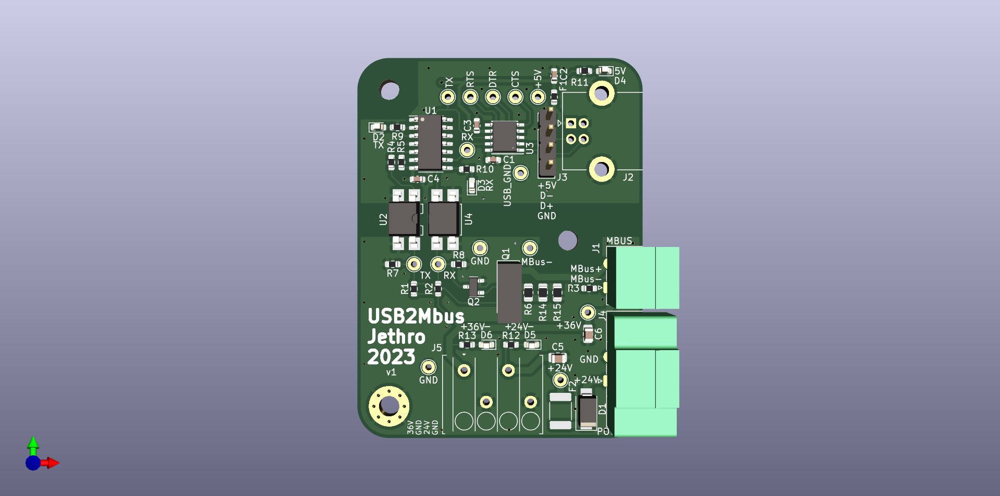

# USB to Mbus master board

Galvanically isolated USB to Mbus converter. Input voltage depends on external
step-up board, intended for use with cheap chinese step-up. USB communication
part is galvanically isolated. 

